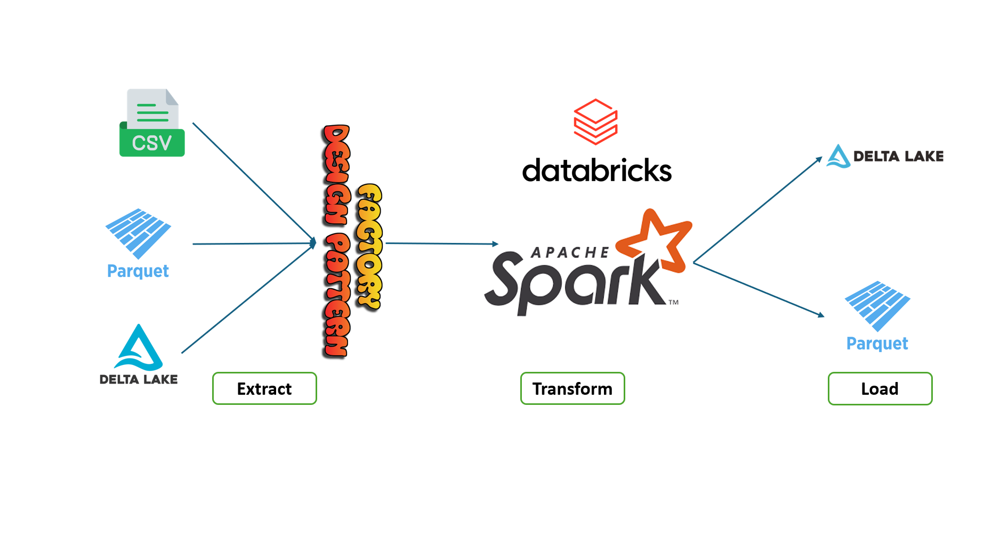

# Apple Product Purchase Analysis ETL Pipeline

## Overview

A modular, scalable ETL pipeline using Apache Spark on Databricks to analyze Apple product purchase patterns. The pipeline processes transaction data to identify specific customer behaviors such as purchasing AirPods after iPhones or customers who only bought specific product combinations.

## Architecture Diagram



*ETL Pipeline showing data flow from source systems through Factory Design Pattern implementation to transformation in Spark and finally to destination systems*

## Features

- Modular Extract, Transform, Load components
- Multiple data source support (CSV, Parquet, Delta Lake)
- Advanced transformation using Spark window functions and array operations
- Flexible data loading with partitioning support
- Factory patterns for extensibility

## Architecture

### Workflow Orchestration
- `WorkFlowRunner`: Manages execution of specific workflows
- Two workflows: `FirstWorkFlow` (AirPods after iPhone) and `SecondWorkFlow` (only iPhone and AirPods)

### Extract Component
- Factory pattern with `get_data_source()` for CSV, Parquet, and Delta formats

### Transform Component
- **AirpodsAfterIphoneTransformer**: Uses Spark window functions to identify customers who purchased an iPhone and then immediately purchased AirPods as their next transaction. The transformation:
  - Partitions data by customer_id
  - Orders by transaction_date
  - Uses lead() function to find the next product purchased
  - Filters for iPhone followed by AirPods
  
- **OnlyAirpodsAndIphone**: Identifies customers who bought only iPhones and AirPods (no other products). The transformation:
  - Groups transactions by customer_id
  - Creates arrays of distinct purchased products using collect_set()
  - Filters for customers who have exactly 2 products (iPhone and AirPods)
  - Uses array_contains() to verify both products exist in the customer's purchase history

### Load Component
- Support for DBFS locations and Delta tables
- Partitioning strategies for optimized queries

## Data Model

- **Transactions**: transaction_id, customer_id, product_name, transaction_date
- **Products**: product_id, product_name, category, price
- **Customers**: customer_id, customer_name, join_date, location

## Tech Stack

- Apache Spark & PySpark SQL
- Delta Lake
- Databricks

## Usage

```python
# Find customers who bought AirPods after iPhone
workFlowRunner = WorkFlowRunner("firstWorkFlow").runner()

# Find customers who only bought iPhone and AirPods
workFlowRunner = WorkFlowRunner("secondWorkFlow").runner()
```

## Setup

1. Upload notebooks to Databricks workspace
2. Upload CSV files to DBFS
3. Run the setup script to create Delta tables
4. Execute main workflow notebook

## Conclusion

This project demonstrates a clean, object-oriented approach to building ETL pipelines in Databricks. The code remains maintainable and extensible by leveraging design patterns like factories and inheritance. The architecture efficiently handles customer purchase pattern analysis while providing a foundation to expand to additional data sources, transformations, and business cases.
